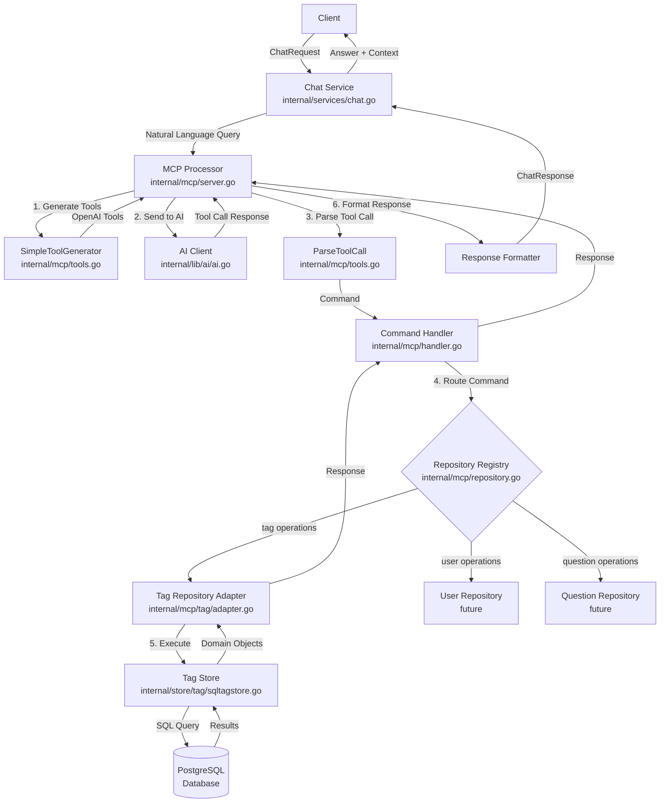

# MCP (Model Context Protocol) Flow Diagram

## Overview
This diagram shows how a chat request flows through the MCP system from the Chat API to the repository layer and back.

## Flow Diagram



## Detailed Flow Steps

### 1. Client Request
```
Client → Chat Service
- User sends natural language query: "how many tags are there?"
- Wrapped in ChatRequest protobuf message
```

### 2. MCP Processing
```
Chat Service → MCP Processor
- ChatService calls mcpProcessor.ProcessRequest(ctx, message)
- MCP Processor manages the entire flow
```

### 3. Tool Generation
```
MCP Processor → SimpleToolGenerator
- Generates OpenAI function definitions for each registered repository
- Example tools: tag_find, tag_count, tag_findById
```

### 4. AI Processing
```
MCP Processor → AI Client → OpenAI API
- Sends user query + available tools to OpenAI
- AI determines which tool to call with what parameters
- Returns tool call: {function: "tag_count", arguments: {}}
```

### 5. Command Parsing
```
Tool Call → Command
- ParseToolCall extracts:
  - Resource: "tag"
  - Operation: "count"
  - Parameters: filter criteria
```

### 6. Command Execution
```
Command Handler → Repository Registry → Tag Repository
- Registry finds the registered repository for "tag"
- Calls appropriate method: tagRepo.Count(ctx, filter)
```

### 7. Database Interaction
```
Tag Repository Adapter → Tag Store → PostgreSQL
- Adapter converts MCP types to store types
- Store executes SQL query
- Results converted back to MCP types
```

### 8. Response Flow
```
Database → Store → Repository → Handler → Processor → Service → Client
- Each layer formats/transforms the response
- Final response includes natural language answer
```

## Key Components

### MCP Processor (`server.go`)
- Central orchestrator
- Manages AI client and tool generation
- Processes natural language → commands → responses

### Repository Registry (`repository.go`)
- Maintains map of resource → repository
- Type-safe registration system
- Supports dynamic resource discovery

### Command Handler (`handler.go`)
- Routes commands to appropriate repositories
- Handles CRUD operations generically
- Error handling and validation

### Repository Adapters (`tag/adapter.go`)
- Bridge between MCP generic interface and domain-specific stores
- Type conversions between MCP and protobuf types
- Implements Repository[T] interface

### Tool Generator (`tools.go`)
- Creates OpenAI function definitions
- Parses AI tool calls into commands
- Supports extensible tool generation

## Example Flow

User: "find public tags, limit to 3"

1. **ChatRequest** arrives at ChatService
2. **MCPProcessor** generates tools including `tag_find`
3. **AI** interprets query and calls: 
   ```json
   {
     "function": "tag_find",
     "arguments": {
       "filter": {
         "public": true,
         "limit": 3
       }
     }
   }
   ```
4. **ParseToolCall** creates Command:
   ```go
   Command{
     Resource: "tag",
     Operation: "find",
     Payload: map[string]interface{}{
       "public": true,
       "limit": 3
     }
   }
   ```
5. **TagRepository** executes Find() with filter
6. **TagStore** runs SQL: `SELECT * FROM tags WHERE public = true LIMIT 3`
7. Results flow back up through layers
8. **MCPProcessor** formats: "I found 3 public tags: Mathematics, Science, History"
9. **ChatResponse** returned to client

## Benefits of MCP Architecture

1. **Separation of Concerns**: Each layer has a single responsibility
2. **Extensibility**: Easy to add new resources/repositories
3. **Type Safety**: Generic Repository[T] pattern ensures compile-time safety
4. **AI Integration**: Natural language interface to structured operations
5. **Testability**: Each component can be tested independently
6. **Flexibility**: Can swap AI providers or add new operations easily